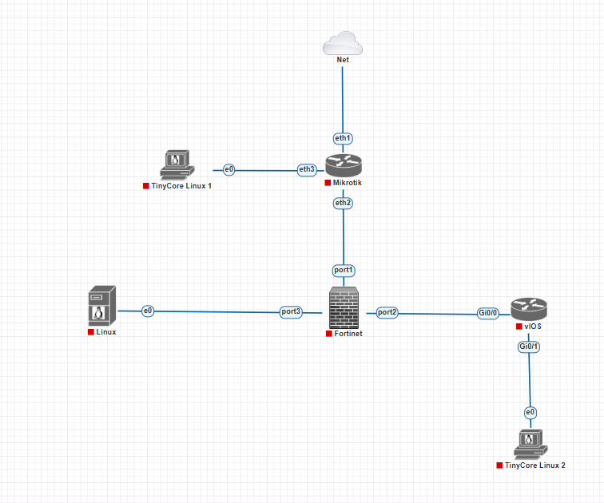
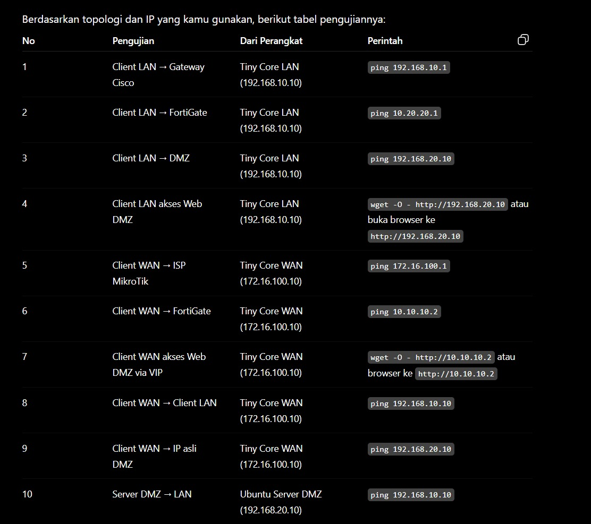
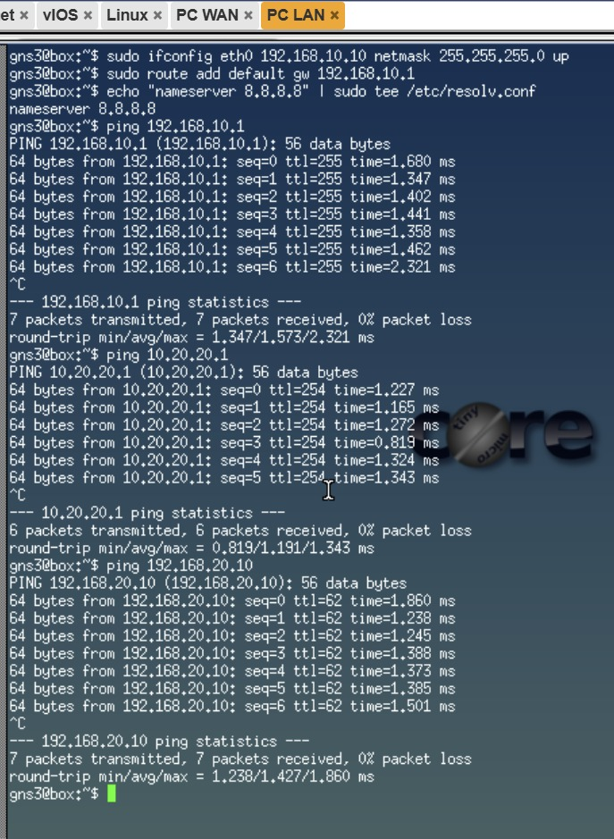
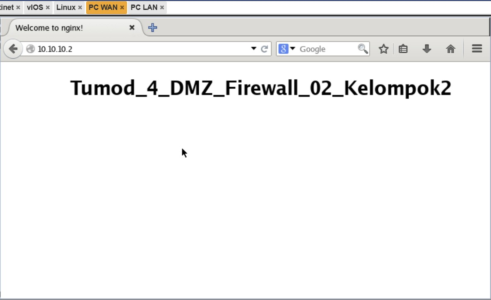
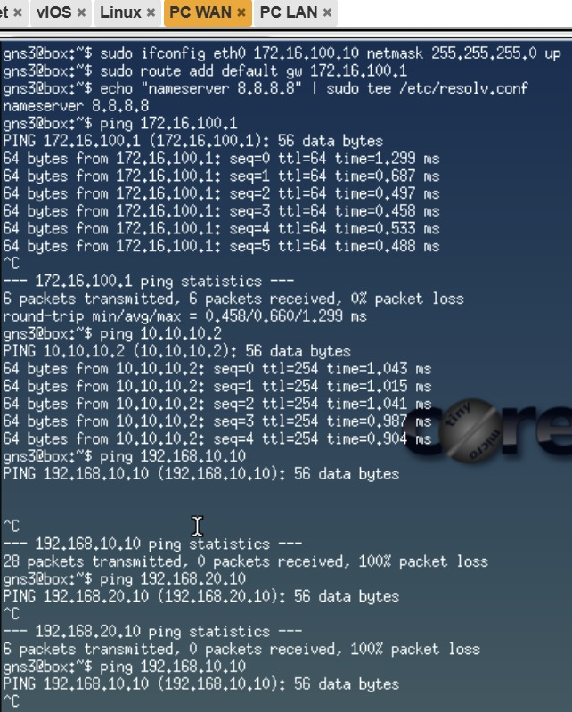
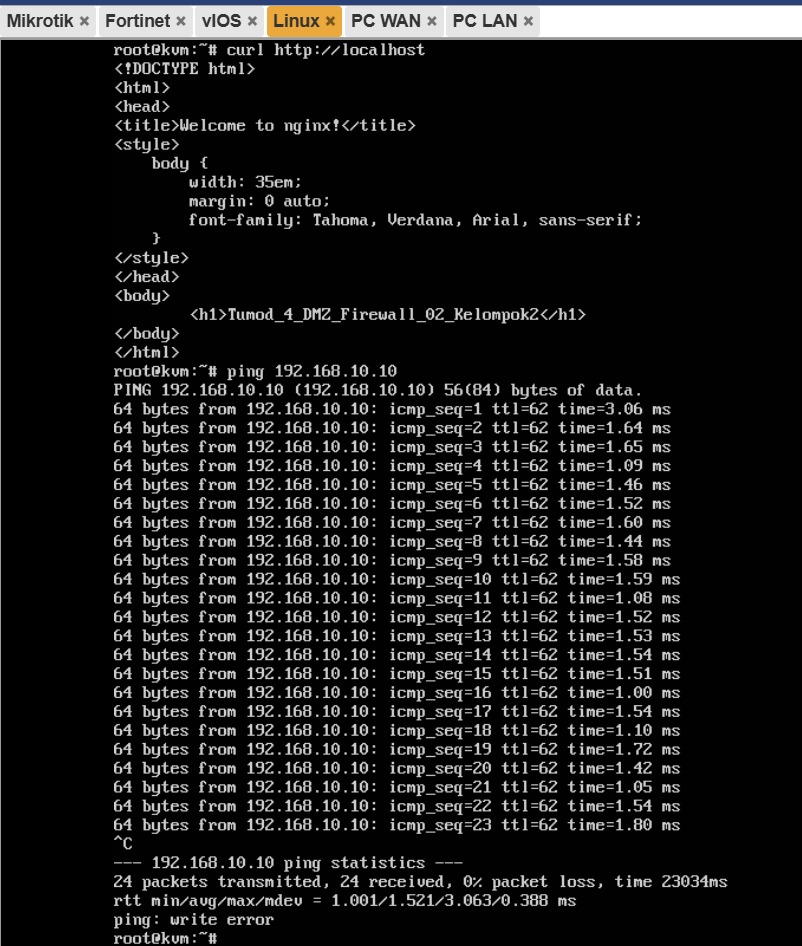

# **Laporan Akhir Tugas Modul P4**
Kelompok 2 LAN-Tester

## **Topologi Jaringan**

## **Tabel IP Address**

## **Konfigurasi Tiap Perangkat**

## **Hasil Pengujian**
### **PC LAN**
#### Pengujian PC LAN ke gateway Cisco,Fortigate, dan DMZ

#### Pengujian PC LAN ke IP DMZ

### **PC WAN**
#### Pengujian PC WAN ke gate Mikrotik,Fortigate,PC LAN, dan DMZ

#### Pengujian PC WAN ke IP DMZ

### **Pengujian server DMZ ke PC LAN**

## **Analisis Dan Kesimpulan**
### **Analisis**
Pada modul ini dilakukan konfigurasi dan implementasi jaringan yang terdiri atas segmen WAN, LAN, dan DMZ dengan memanfaatkan MikroTik ISP, FortiGate Firewall, Cisco Router, serta Ubuntu Server yang berperan sebagai web server.

FortiGate digunakan sebagai perangkat keamanan utama yang mengelola lalu lintas jaringan melalui konfigurasi static route, firewall policy, dan Virtual IP (VIP). Selain itu, fitur NAT diterapkan agar perangkat pada jaringan LAN dapat mengakses internet. Untuk meningkatkan keamanan, akses dari jaringan WAN menuju server yang berada di DMZ hanya diperbolehkan melalui layanan HTTP menggunakan teknik port forwarding.

Berdasarkan hasil pengujian, client pada jaringan LAN berhasil mengakses server DMZ maupun internet tanpa kendala. Sementara itu, client dari jaringan WAN dapat mengakses web server menggunakan alamat publik FortiGate, namun tidak memiliki akses langsung ke jaringan LAN maupun alamat asli server DMZ. Hasil ini menunjukkan bahwa mekanisme segmentasi jaringan dan aturan keamanan yang diterapkan telah berfungsi dengan baik sesuai kebutuhan.

### **Kesimpulan**
Berdasarkan konfigurasi dan pengujian yang telah dilakukan, implementasi DMZ pada FortiGate dapat berjalan sesuai dengan yang direncanakan. Server yang ditempatkan di zona DMZ berhasil diakses dari jaringan eksternal melalui port forwarding, sementara akses langsung ke jaringan internal tetap terlindungi. Selain itu, penerapan firewall policy mampu mengatur dan membatasi komunikasi antar jaringan sehingga keamanan jaringan dapat terjaga.

Secara keseluruhan, praktikum ini berhasil memenuhi tujuan yang telah ditetapkan, yaitu melakukan konfigurasi routing, firewall policy, NAT, DMZ, serta port forwarding pada lingkungan jaringan yang tersegmentasi.

