# **Laporan Akhir Tugas Modul 5**
Kelompok 2 LAN Tester

## **Topologi Jaringan**
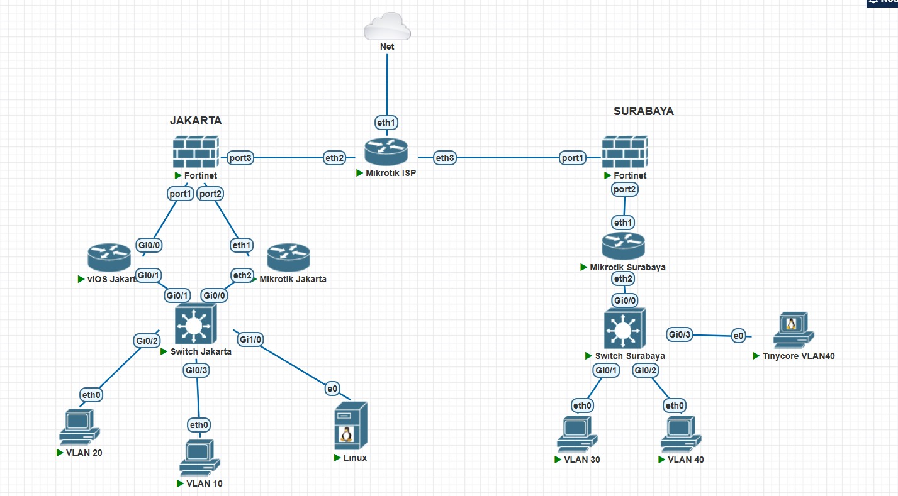

## **Tugas Modul 1**
### Screenshot `show interfaces trunk`
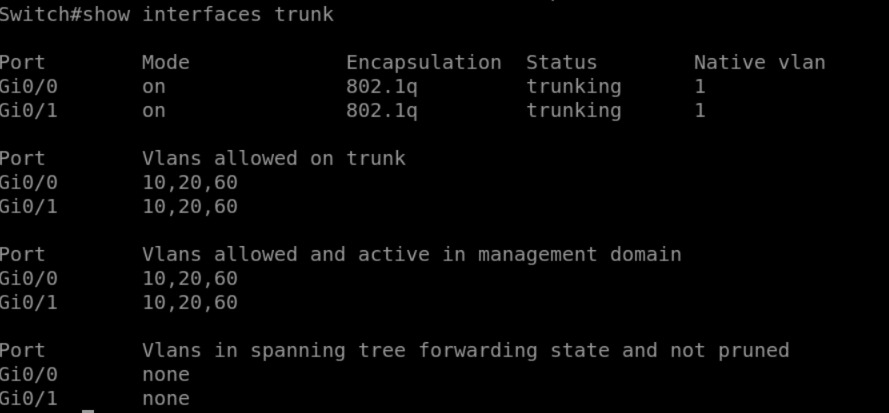
### Screenshot `show vlan brief`
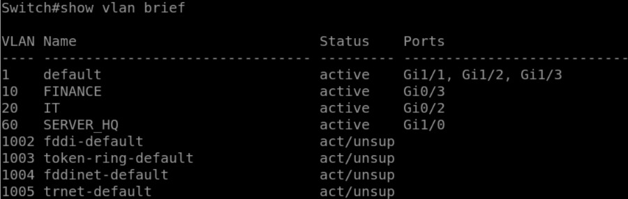

## **Tugas Modul 2**
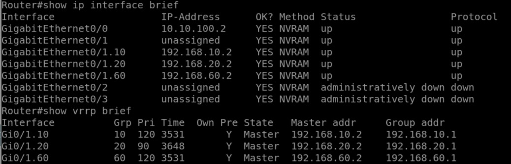
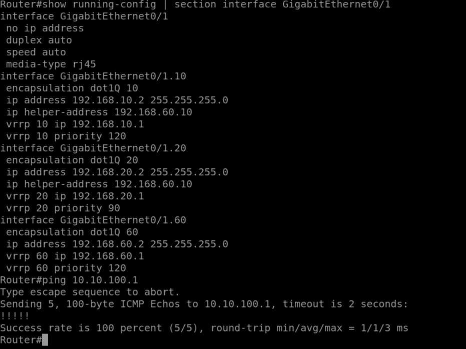

## **Tugas Modul 3**
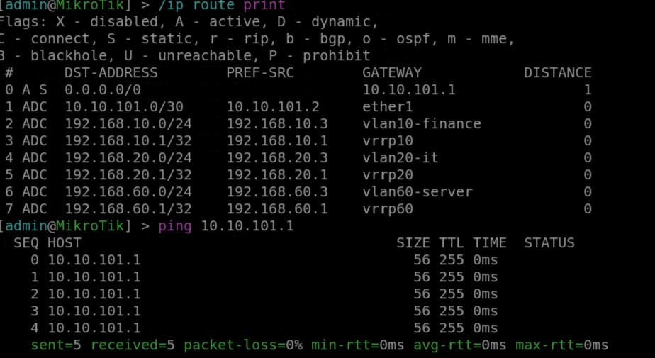
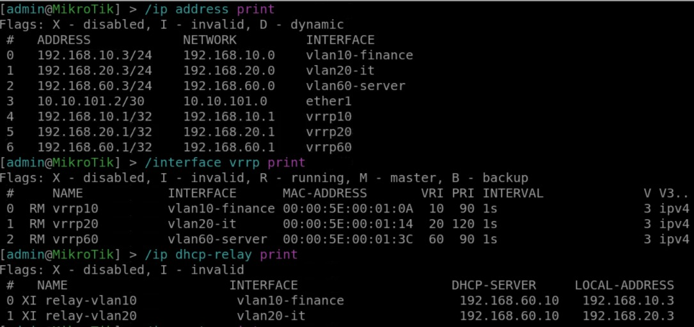
## **Tugas Modul 5**

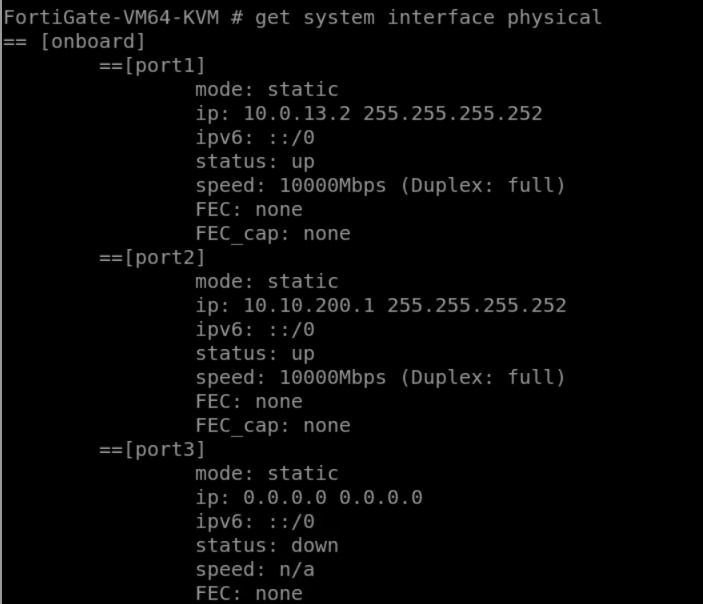
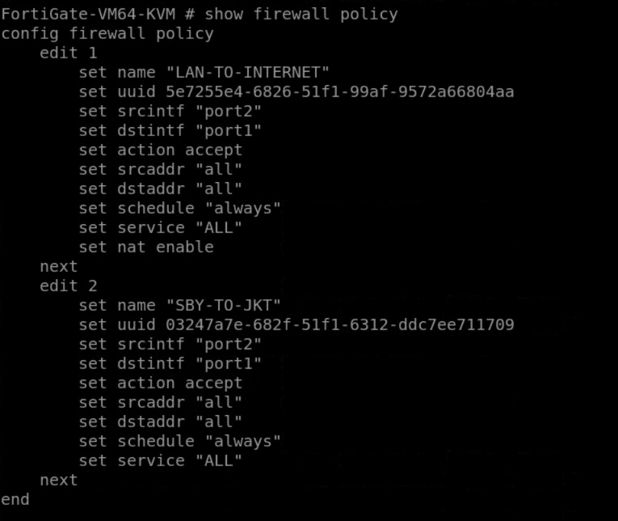
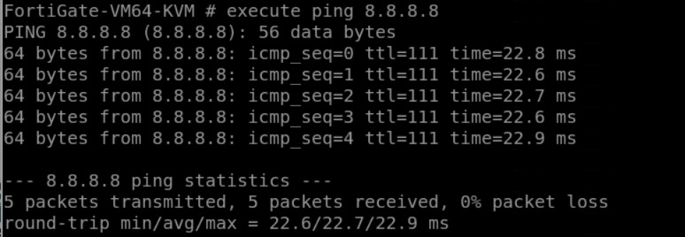
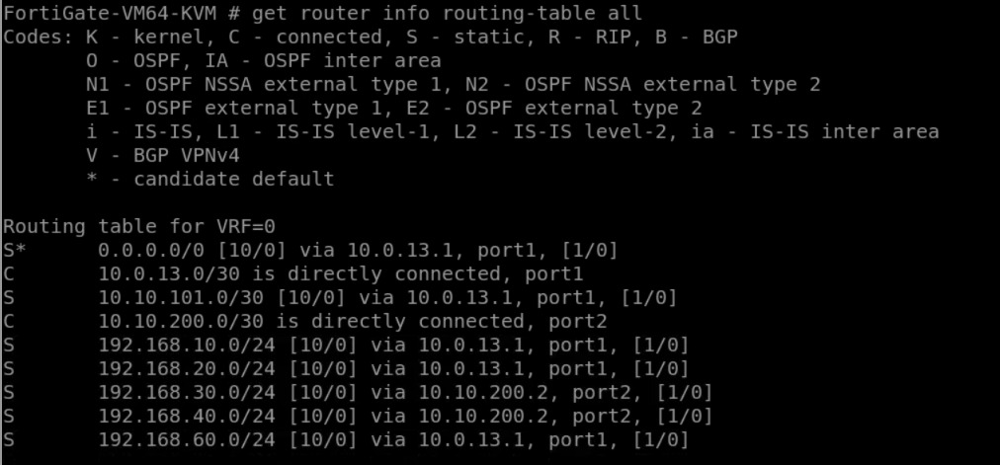
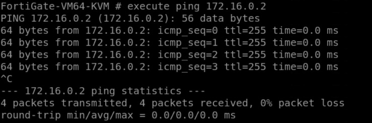

